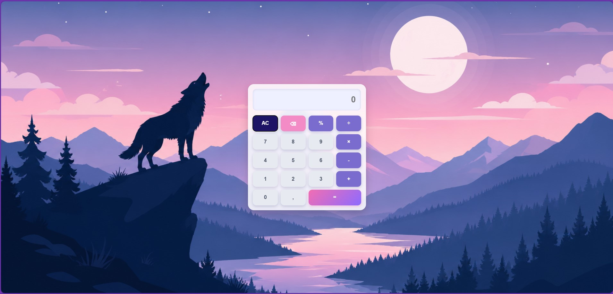
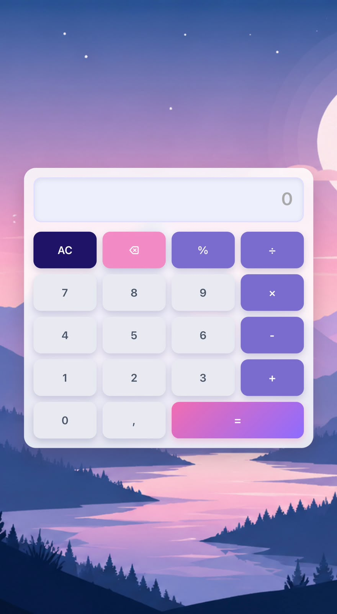

# 🧮 Calculadora Simples

Uma calculadora moderna desenvolvida com **HTML, CSS e JavaScript**, com interface inspirada em tons de azul, lilás e rosa, combinando um visual elegante com uma experiência de uso intuitiva.

## 🔗 Acesse o projeto

**GitHub Pages:**
[https://ginaaguiar.github.io/calculadora-simples/](https://ginaaguiar.github.io/Calculadora-Simples/)

## 📸 Preview

### 💻 Versão Desktop



### 📱 Versão Mobile



## ✨ Funcionalidades

* Operações matemáticas básicas:

  * Adição (+)
  * Subtração (-)
  * Multiplicação (×)
  * Divisão (÷)

* Cálculo de porcentagem (%)

* Botão para limpar toda a operação (AC)

* Botão para apagar o último caractere (⌫)

* Suporte ao teclado físico:

  * Números
  * Operadores matemáticos
  * Enter (=)
  * Backspace
  * Esc

* Tratamento de erros matemáticos

* Interface responsiva para desktop e dispositivos móveis

## 🎨 Destaques do Design

* Efeito Glassmorphism
* Fundo ilustrado personalizado
* Paleta de cores em tons de:

  * Azul Escuro
  * Lilás
  * Rosa
  * Branco Lunar
* Animações suaves nos botões
* Layout moderno e minimalista

## 🛠️ Tecnologias Utilizadas

* HTML5
* CSS3
* JavaScript (Vanilla JS)

## 📱 Responsividade

O projeto foi desenvolvido para se adaptar a diferentes tamanhos de tela, oferecendo uma boa experiência tanto em computadores quanto em smartphones.

## 📂 Estrutura do Projeto

```text
calculadora-simples/
│
├── index.html
├── style.css
├── script.js
│
└── imagens-calculadora-simples/
    ├── captura-de-tela-calculadora-simples-mobile.png
    ├── captura-de-tela-calculadora-simples.jpg
    └── imagem-capa-calculadora.png
```

## 🚀 Aprendizados

Durante o desenvolvimento deste projeto foram praticados conceitos como:

* Manipulação do DOM
* Eventos JavaScript
* Funções e operadores matemáticos
* Responsividade com Media Queries
* Grid Layout
* Glassmorphism
* Experiência do Usuário (UX)

## 👩‍💻 Desenvolvido por

**Gina P. Aguiar**

Projeto desenvolvido para fins de estudo, prática e composição de portfólio.
